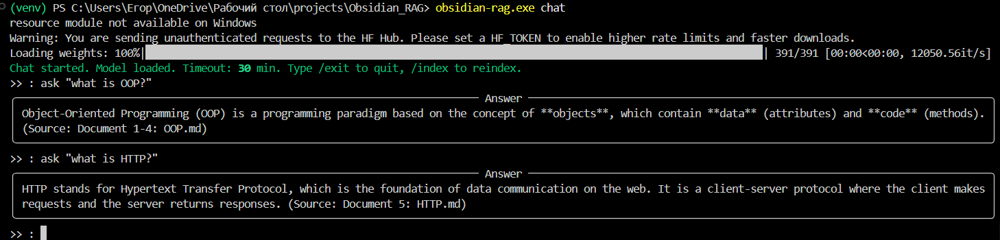

```markdown
# Memex

RAG system for searching and asking questions about your Obsidian vault.

##  Features

- ✅ **Hybrid search** — BM25 + semantic search (FAISS) + RRF
- ✅ **Parent-Child chunking** — preserves context from headers and sections
- ✅ **Chat mode** — models stay in RAM for instant responses
- ✅ **Online/offline modes** — Groq/DeepSeek API or local search without LLM
- ✅ **CLI interface** — `index`, `ask`, `chat`, `config`

## 📸 Demo



##  Requirements

- Python 3.10+
- [Groq API key](https://console.groq.com) or [DeepSeek API key](https://platform.deepseek.com/) (for online mode)

##  Quick Start

### Installation

```bash
# Clone the repository
git clone https://github.com/GorkaEgor4kas/Memex.git
cd Memex

# Install in development mode
pip install -e .
```

### Configuration

```bash
# Copy environment variables template
cp .env.example .env

# Edit .env with your API keys
# GROQ_API_KEY=your_key_here
# MEMEX_PROVIDER=groq
# MEMEX_MODEL=llama-3.3-70b-versatile
```

### Index your vault

```bash
memex index
```

### Ask a question

```bash
memex ask "what did I write about decorators?"
```

### Chat mode (recommended)

```bash
memex chat
```

##  Commands

| Command | Description |
|---------|-------------|
| `index` | Index all markdown files in the vault |
| `ask "query"` | Search and generate answer |
| `chat` | Interactive chat mode (models stay loaded) |
| `config` | Manage settings (show, reset, set-key) |

### Ask Options

| Flag | Description |
|------|-------------|
| `--offline`, `-o` | Force offline mode (search only, no LLM) |
| `--show-sources`, `-s` | Display source files with answer |
| `--verbose`, `-v` | Show detailed processing info |

### Index Options

| Flag | Description |
|------|-------------|
| `--force`, `-f` | Full reindexing of your vault |
| `--verbose`, `-v` | Detailed output info |
| `--dry-run`, `-n` | Preview files that will be indexed |

## 🔧 Configuration

Settings are stored in `~/.memex/config.yaml`

### Example configuration

```yaml
vault_path: "~/Documents/Obsidian"
mode: auto  # auto, online, offline

indexing:
  chunk_size: 500
  chunk_overlap: 50
  use_parental: true

retrieval:
  semantic_limit: 10
  bm25_limit: 10
  rrf_k: 60
  final_limit: 5

online:
  provider: groq  # groq, deepseek
  model: llama-3.3-70b-versatile
  temperature: 0.2
  max_tokens: 1000

thresholds:
  bm25_min_score: 1.0
  vector_min_similarity: 0.5
```

## 📁 Project Structure

```
memex/
├── src/
│   ├── cli/           # Typer commands (index, ask, chat, config)
│   ├── retrieval/     # BM25, FAISS, RRF, hybrid search
│   ├── generation/    # LLM clients, decider, prompts
│   ├── indexing/      # Chunker, Embedder, Index State, Vault handlers
│   └── core/          # Config, models, exceptions
├── tests/
├── config/
│   └── .env.example
├── pyproject.toml
└── README.md
```

##  Example

```bash
$ memex ask "what did I learn about decorators?" --show-sources

 Searching...
Found 3 relevant chunks

 Answer:
Based on your notes, a decorator in Python is a function that takes
another function as an argument and extends its behavior without
modifying it directly.

Sources:
- notes/python/decorators.md
- notes/python/advanced.md
```

##  Known Issues

- First query in chat mode takes ~15 seconds (models loading into RAM)
- Without chat mode, each query takes ~15 seconds
- Chat mode keeps models in memory for instant subsequent queries

##  License

MIT License — see [LICENSE](LICENSE) file

##  Author

- GitHub: [@GorkaEgor4ka](https://github.com/GorkaEgor4kas)

---

⭐ If this project helped you, give it a star on GitHub!
```
